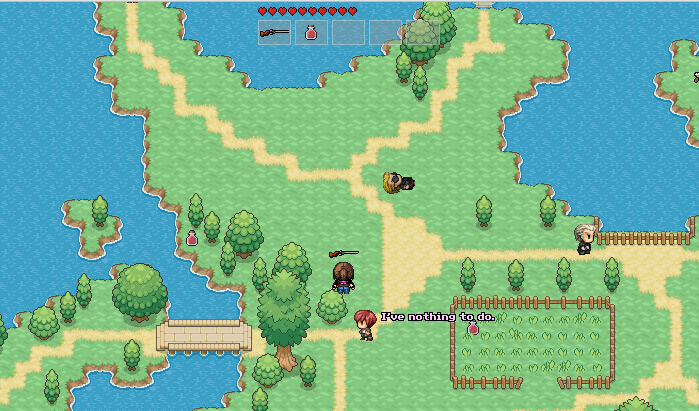

# AGENTS 1.0

Simple MORPG implementation in Godot. 
It is a pure hobby project written just to find out how difficult is to write a server-governed multi-player game in Godot.

It's not a complete game, it only has a few essential features and can be used as an inspiration on how to deal with server-client communication in your Godot projects.

## Features

The project features a multiplayer game where each player controls a single character by issuing commands rather than controlling the character movement directly.
This was a design choice as such a control scheme is more suitable to slower-paced RPGs (or RTSs) which I'm more interested in than FPSs.
The code can be easily modified to allow for controlling of multiple units (RTS style)

- *game features*
  - free character movement around a map
  - inventory & usable items
  - scanline weapons
  - basic health & damage logic
- *multi-player code*
  - lobby & chat
  - full server autority sync scheme
  - fast unreliable updates for the world state
  - slower reliable updates for events (e.g. player join, item pickup, effects, etc.)
- *tile sets*
  - all tile types used (autotiles, atlas tiles, single tiles)
  - correctly working *YSort* for large single tiles (with correct origin at the bottom)
- *AI*
  - collision-based sensors for hearing and sight
  - A* navigation with preferred paths (roads) and obstacles.
  - rudimentary AI for NPCs (walk around and say lines)
  
## Design Philosophy 

I tried to follow best practices recommended by the Godot team (like aggregation over inheritance, encapsulating scripts to nodes they affect etc.) but I also wanted to **make it as simple as possible** so there are some tradeoffs.
Many things can be (and should be) done diferently for the bigger project. Anyway, I believe in short iterations and adding stuff only when necessary and again, simplicity.

The code isn't fully commented but should be self-explanatory. I tried to explain myself when the code started to look hairy.

For the net code, I used Godot's high-level multiplayer framework which works perfectly for my use-case.
I mixed the server and the client code together and extensively use `remotesync` keyword where any udpate to both server/client was needed, occasionally adding `master/puppet` to indicate special cases.

I tried to separate the server section and the remote section so it can be seen what runs on server only and whats propagated to clients.
  
## Future Development

The project isn't by any mean feature complete and I do not guarantee or plan to add new features in near future.
I might continue with the development and put more stuff in (especially around NPCs AI support) but it really depends on my free time.

Anyway, I welcome any comment, suggestion or bug report but cannot guarantee I'll intergate it. Feel free to fork it for yourself.

## License

Published under MIT license but there are some files (tilesets) that are for non-commercial uses only!

## Credits
Many, many thanks to:
- [Magiscarf](https://www.deviantart.com/magiscarf) for amazingly detailed tilesets 
- [DoubleLeggy](https://www.deviantart.com/doubleleggy) for a beautiful set of character animations
